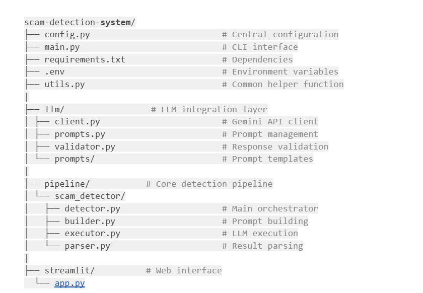
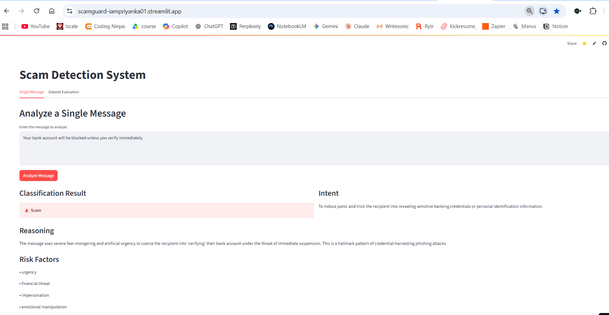
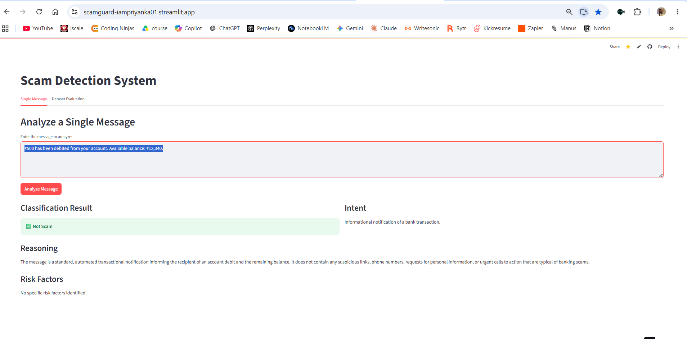
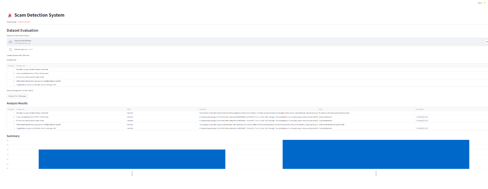

# 🚨 ScamGuard AI: Protecting Trust with Generative Intelligence

ScamGuard AI is a modular, scalable system designed to detect scam messages using **Google Gemini**, **Streamlit**, and modern prompt engineering techniques. It classifies messages as **Scam**, **Not Scam**, or **Uncertain**, while also providing reasoning, intent, and risk factors.

---

## 📌 Features
- **Single Message Analysis** – Enter a message and get instant classification with reasoning.
- **Dataset Evaluation** – Upload a CSV file and analyze multiple messages in batch.
- **Explainable AI** – Outputs structured JSON with label, reasoning, intent, and risk factors.
- **Modular Architecture** – Prompt builder, executor, parser, and detector components.
- **Extensible** – Add multi-language support, threat database integration, or feedback loops.

---

## 🛠 Tech Stack
- **Python 3.10+**
- **Streamlit** – Web interface
- **Gemini API** – LLM reasoning
- **Pandas** – Dataset handling
- **Custom Parser** – Converts raw LLM output into structured JSON

---

## 🏗️ Project Structure


---

## ⚙️ Installation

### 1. Clone the repository
```bash
git clone https://github.com/YOUR_USERNAME/ScamGuard.git
cd scam-detection
```
###  2. Create a virtual environment
```bash
python -m venv venv
```
**Activate:**
**Window**s: venv\Scripts\activate
**Mac/Linux**: source venv/bin/activate

### 3. Install dependencies
```bash
pip install -r requirements.txt
```

### 4. Configure environment
Create a .env file:
```bash
GEMINI_API_KEY=your_google_api_key_here
```
### 📦 Requirements
```bash
google-genai==1.27.0
pandas==2.3.3
pydantic==2.11.7
python-dotenv==1.1.1
streamlit==1.47.1
tqdm==4.67.1
```
---
## 🚀 Usage

**Run CLI**
```code
python main.py
```
**Run Streamlit App**
```code
streamlit run streamlit/app.py
```
---
## 📂 Sample Dataset

You can download the sample dataset used for testing here:  
[Download Sample Data (CSV)](https://drive.google.com/file/d/15EIHzMQKD_aSaI_lAeJpha1mTj2Ze8ZQ/view)

---

## 🎥 Demo

### Single Message Scam Example
Input:
“Your bank account will be blocked unless you verify immediately.”



### Single Message Non-Scam Example
Input:
“₹500 has been debited from your account. Available balance: ₹12,340.”



### Multiple Message Example
Input: You can download the sample dataset used for testing here:  
[Download Sample Data (CSV)](https://drive.google.com/file/d/15EIHzMQKD_aSaI_lAeJpha1mTj2Ze8ZQ/view)


### 📚 Example Output
```json
{
  "label": "Scam",
  "reasoning": "The message explicitly requests the recipient to share a One-Time Password (OTP)...",
  "intent": "To trick the recipient into sharing their OTP",
  "risk_factors": ["account compromise", "financial risk", "confidential information request"]
}
```
---
## 🏆 Educational Value

This project demonstrates:
Prompt engineering strategies (Zero-shot, Chain-of-Thought, ReAct).
Modular AI design for scalability.
Building explainable, trustworthy AI systems.
Real-time user-facing interfaces with Streamlit.


